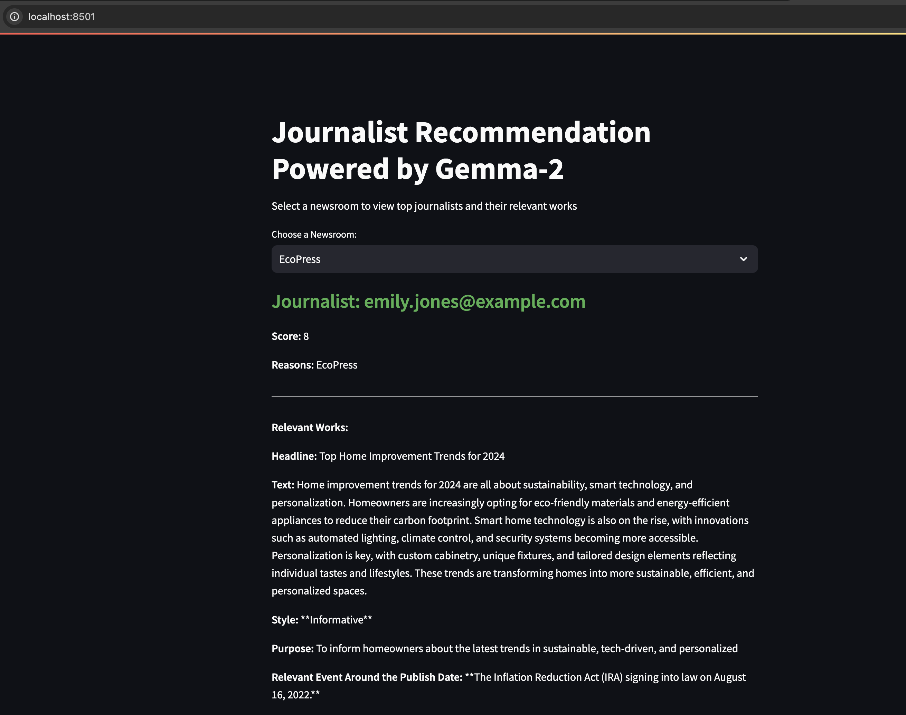

# Mynewsdesk Assignment

**Developed by Vaibhav Saxena**

It is a streamlit run api that recommends top 3 journalists that are most suitable for each news room. The api runs directly over the csv files which have been developed on the jupyter notebook. The solution leverages heavily **Gemma-2 2b Intruct** LLM for a variety of reasons: 

- its inferenced locally on an Apple silicon chip
- the dataset size was manageable
- the assigment for the most part dealt with English language.

The entire process is plotted throughly in the jupyter notebook `mnd_play.ipynb`.

---

## Features

- Select a newsroom from a dropdown menu.
- View the top 3 journalists with the highest scores for the selected newsroom.
- See detailed information for each journalist, including:
  - Journalist email
  - Score and reasons for the score
  - Top 3 articles by the journalist, including:
    - Headline
    - Article text
    - Journalist’s style and purpose
    - Relevant event

---

## Requirements for the API

To run this application locally, you need Python and the following libraries installed:

- `pandas` - For reading and processing CSV data.
- `streamlit` - For building the interactive web application.

## How to Run
Clone this repository or download the project files to your local machine.

Make sure you have your CSV files (scores.csv and articles_xformed.csv) ready in the project directory along side requirements.txt and app.py. These files should contain:

scores.csv: The scores and information related to journalists.
articles_xformed.csv: The articles related to the journalists.

Create a virtual environment (assuming python is already installed).
- `python3 -m venv [env_name]`

Activate the virtual environment
- `source /.[env_name]/bin/activate`

### Install dependencies

Run the following command:
- `pip install -r requirements.text`

Run the Streamlit app with the following command:

`streamlit run app.py`

This will prompt a web app on the localhost server which will facilitate the UI. The UI will look somewhat as follows:

---

# Jupyter Notebook:

The libraries needed to be installed as part of the notebook are listed in the first cell.

As part of the preliminary data analysis, following exercises have been performed:

   1. Plot a simple word cloud
   2. Bar chart for most common words
   3. Length of text distribution
   4. Sentiment analysis using both vaderSentiment and BERT
   5. N-grams analysis: justa bi-gram for now
   6. Topic modelling using BERTopic
   7. Extractive summarization of text using BART and a multilingual embedding model
   8. Cosine similarities between headline and text, headline and extracted summary
   9. LLM promptings
---

## LLM

The model that was used for this exercise is Gemma-2 2b instruct model, solely for the reason of reproducing the result without having to need a GPU. This model can run just fine on an Apple silicon chip. But be mindful that *some prompts can take more than an hour*.

The LLM was prompted multiple times for following reasons:

- Classifying a style for the journalist (2-4 words)
- The purpose for writing the article (5-10 words)
- The quality of the text written (integer score)
- Finding a relevant event around the date of publishing that could affect the text in the article

### Putting together a comprehensive context:

There were 2 contexts prepared:

1. one that combines the results of all the prompt that mentioned above in a semantic and add the `text` and `headline` field to that, for each journalist.
2. second that combines `newsroom`, `headline` and `text` from the `fake_pressreleases.csv` file.

Once both the prompts are prepared, the LLM is prompted to generate the following info:

- rating of a journalist for each newsroom based on few run-of-the-mill barometers such as writing style, sentiment, and alignment with newsroom expectations. It can be found in the notebook. Each journalist's context is pitted against the press_releases contextand ratings for all permutations possible have been attained.

- explanation for those scores

All the results in this exercise have been saved on scores.csv.

# Streamlit

The `app.py` file utilizes both `articles_xformed.csv` which was obtained as part of the data analysis and `scores.csv` which was calculated as part of LLM prompting, and renders a simple UI that allows users to select a newsroom and get displayed of top 3 journalists that suit that newsroom the best along side some of the relevant info that was pulled from their previous work and LLM promptings.

